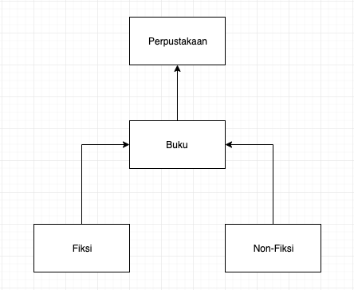

# TUGAS 5 ASISTENSI PBO - Jumat, 1 November 2019

NAMA: `isi nama disini`

NRP: `isi nrp disini`

## Deskripsi Tugas
Buatlah UML diagram sesuai dengan class, object, method dan property yang kamu buat, sebagai referensi untuk memulai:

<center></img></center>

Inisiasi sebuah array buku, yang bernama perpustakaan secara langsung mempunyai 3 buah buku yang ditentukan secara random.
  - yang di random adalah: jenis buku
  - judul dan pengarang bebas

Lalu sebuah command line interface sebuah pada programnya yang mempunyai opsi:
```
================================================================================================
 ____    ____    ____    ____    __  __  ____    ______  ______  __  __   ______  ______  __  __
/\  _`\ /\  _`\ /\  _`\ /\  _`\ /\ \/\ \/\  _`\ /\__  _\/\  _  \/\ \/\ \ /\  _  \/\  _  \/\ \/\ \
\ \ \L\ \ \ \L\_\ \ \L\ \ \ \L\ \ \ \ \ \ \,\L\_\/_/\ \/\ \ \L\ \ \ \/'/'\ \ \L\ \ \ \L\ \ \ `\\ \
 \ \ ,__/\ \  _\L\ \ ,  /\ \ ,__/\ \ \ \ \/_\__ \  \ \ \ \ \  __ \ \ , <  \ \  __ \ \  __ \ \ , ` \
  \ \ \/  \ \ \L\ \ \ \\ \\ \ \/  \ \ \_\ \/\ \L\ \ \ \ \ \ \ \/\ \ \ \\`\ \ \ \/\ \ \ \/\ \ \ \`\ \
   \ \_\   \ \____/\ \_\ \_\ \_\   \ \_____\ `\____\ \ \_\ \ \_\ \_\ \_\ \_\\ \_\ \_\ \_\ \_\ \_\ \_\
    \/_/    \/___/  \/_/\/ /\/_/    \/_____/\/_____/  \/_/  \/_/\/_/\/_/\/_/ \/_/\/_/\/_/\/_/\/_/\/_/

================================================================================================

[1]. input buku baru
[2]. modifikisi detail buku
[3]. hapus buku
[0]. EXIT

================================================================================================
Jumlah buku di dalam perpustakaan: _
Rata-rata halaman buku dalam perpustakaan: _
Standar deviasi halaman buku dalam perpustakaan: _
================================================================================================
Jumlah Buku Fiksi dalam perpustakaan: _
Rata-rata halaman Buku Fiksi dalam perpustakaan: _
Standar deviasi halaman Buku Fiksi dalam perpustakaan: _
================================================================================================
Jumlah Buku Non Fiksi dalam perpustakaan : _
Rata-rata halaman Buku Non Fiksi dalam perpustakaan: _
Standar deviasi halaman Buku Non Fiksi dalam perpustakaan: _
================================================================================================
```
---
## jika user memilih 1:
```
================================================================================================
 ____            __                  ____
/\  _`\         /\ \                /\  _`\
\ \ \L\ \  __  _\ \ \/'\   __  __   \ \ \L\ \     __    _ __   __  __
 \ \  _ <'/\ \/\ \ \ , <  /\ \/\ \   \ \  _ <'  /'__`\ /\`'__\/\ \/\ \
  \ \ \L\ \ \ \_\ \ \ \\`\\ \ \_\ \   \ \ \L\ \/\ \L\.\\ \ \/ \ \ \_\ \
   \ \____/\ \____/\ \_\ \_\ \____/    \ \____/\ \__/.\_\ \_\  \ \____/
    \/___/  \/___/  \/_/\/_/\/___/      \/___/  \/__/\/_/\/_/   \/___/

================================================================================================

input judul buku:
>
input pengarang buku:
>
input jumlah halaman buku:
>
```
dengan catatan:
- judul buku harus string, jika bukan string maka kembali ke menu awal
- jumlah halaman buku harus int, jika bukan int maka kembali ke menu awal

---

## jika user memilih 2:
```
================================================================================================
 __  __     ______     ______   __  __     ______        ______     __  __     __  __     __  __
/\ \_\ \   /\  __ \   /\  == \ /\ \/\ \   /\  ___\      /\  == \   /\ \/\ \   /\ \/ /    /\ \/\ \
\ \  __ \  \ \  __ \  \ \  _-/ \ \ \_\ \  \ \___  \     \ \  __<   \ \ \_\ \  \ \  _"-.  \ \ \_\ \
 \ \_\ \_\  \ \_\ \_\  \ \_\    \ \_____\  \/\_____\     \ \_____\  \ \_____\  \ \_\ \_\  \ \_____\
  \/_/\/_/   \/_/\/_/   \/_/     \/_____/   \/_____/      \/_____/   \/_____/   \/_/\/_/   \/_____/

================================================================================================

Pilih buku yang akan diubah:
[1] buku_1 | pengarang_1
[2] buku_2 | pengarang_2
[3] buku_3 | pengarang_3
```
jika buku sudah terpilih maka kembali ke menu "Buku Baru"

---

## jika user memilih 3:

```
================================================================================================
 __  __     ______     ______     __  __        ______     __  __     __  __     __  __
/\ \/\ \   /\  == \   /\  __ \   /\ \_\ \      /\  == \   /\ \/\ \   /\ \/ /    /\ \/\ \
\ \ \_\ \  \ \  __<   \ \  __ \  \ \  __ \     \ \  __<   \ \ \_\ \  \ \  _"-.  \ \ \_\ \
 \ \_____\  \ \_____\  \ \_\ \_\  \ \_\ \_\     \ \_____\  \ \_____\  \ \_\ \_\  \ \_____\
  \/_____/   \/_____/   \/_/\/_/   \/_/\/_/      \/_____/   \/_____/   \/_/\/_/   \/_____/

================================================================================================

Pilih buku yang akan dihapus:
[1] buku_1 | pengarang_1
[2] buku_2 | pengarang_2
[3] buku_3 | pengarang_3
```
---

**untuk melihat cara print banner, ke [info](info.md)**

hanya sebagai hiasan saja, jika bisa print-nya, ya bagus, jika tidak bisa diganti text biasa tidak apa-apa, silahkan dihias menurut kreativitas masing-masing individu

---
## extra mile
- simpanlah kumpulan array dalam sebuah file `.txt` dengan format:
  ```
  "judul_buku"      : ____,
  "pengarang"       : ____,
  "jumlah_halaman"  : ____,
  "jenis_buku"      : "fiksi"/"non_fiksi"
  ```
  pada tiap buku, liat contohnya [disini](sample.txt)


- buatlah error handling dimana yang menurut saudara cocok untuk di handle.
  - semakin tercover semua error casenya, semakin baik (the more, the merrier 🤭)


## Hasil
buatlah sebuah demo video yang merekam semua case (menambah, mengedit, menghapus buku, serta seluruh error handlingnya (jika ada)), upload ke youtube dan sertakan linknya [disini](INSERT_YOUTUBE_URL_HERE)


## Upload
upload seluruh folder project java-nya ke repository ini

## frequently asked question
[dilihat disini](info.md)
